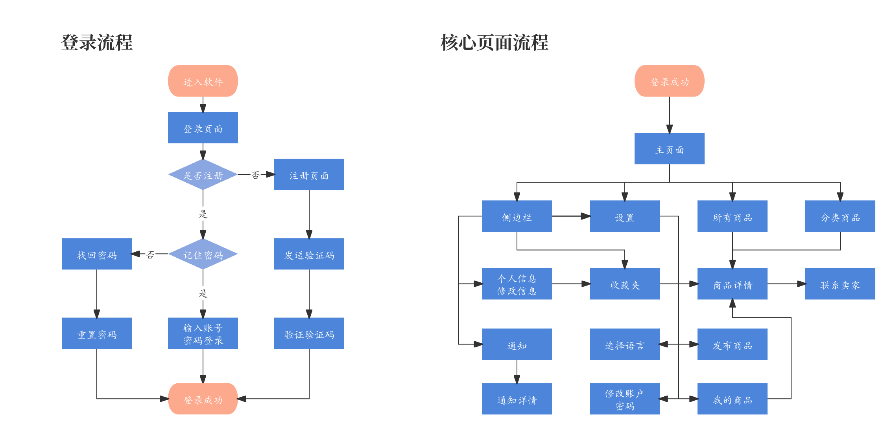

# ZDSwap
面向中山大学的二手交易小程序：校园转转

- **[简体中文](./README-cn.md)**
- **[English](./README.md)**

<div align="center">

## 面向中山大学的二手交易小程序：校园转转
[📄[Document](hhttps://github.com/ffengc/ZDSwap/blob/main/README.md)] &emsp; [💻[Platform](https://www.nginx.org.cn/)] &emsp; <br>
[🌅[Code](https://github.com/ffengc/ZDSwap)] &emsp;<br>

</div>

***

- [ZDSwap](#zdswap)
  - [面向中山大学的二手交易小程序：校园转转](#面向中山大学的二手交易小程序校园转转)
  - [🌟项目成员🌟](#项目成员)
  - [📃项目页面结构](#项目页面结构)
  - [📸项目效果](#项目效果)
  - [🐳用docker部署nginx服务](#用docker部署nginx服务)

***

## 🌟项目成员🌟

- Yufc([ffengc](https://github.com/ffengc))
- Songwh([ssugarwh](https://github.com/ssugarwh))
- Linjy([ssugarwh](https://github.com/ssugarwh))
- Pengyx([KuroisuSan](https://github.com/KuroisuSan))
- Liy([*](#))


## 📃项目页面结构

下图展示了本项目所有页面。



## 📸项目效果

**主页面:**


其他页面不在这里展示了。

## 🐳用docker部署nginx服务

克隆仓库：
```bash
https://github.com/ffengc/ZDSwap.git
cd ZDSwap;
```

使用dockerfile进行部署：

**1. 创建dockerfile文件**

```dockerfile
FROM nginx:latest
COPY ./wwwroot /usr/share/nginx/html
EXPOSE 8080
CMD ["nginx", "-g", "daemon off;"]
```

**2. 给文件添加权限**

创建脚本`ChMod.sh`

```bash
#!/bin/bash
# write by Yufc
# 检查是否提供了目录作为参数
if [ "$#" -ne 1 ]; then
    echo "Usage: $0 <directory>"
    exit 1
fi
# 获取目录参数
directory=$1
# 检查目录是否存在
if [ ! -d "$directory" ]; then
    echo "Error: Directory does not exist."
    exit 1
fi
# 为目录及其子目录下的所有文件和文件夹增加权限
find "$directory" -type d -exec chmod a+rwx {} \;
find "$directory" -type f -exec chmod a+rwx {} \;
echo "ALL permissions have been added to all files and directories within $directory."
```

运行脚本： `./ChMod.sh ./wwwroot`

**3. 部署服务**

```bash
docker build -t nginx-homepage .
docker run -d -p 8080:80 nginx-homepage
```

**部署后访问服务器8080端口即可。**

## 感谢Suha-Multipurpose Ecommerce Mobile HTML Template提供模板
