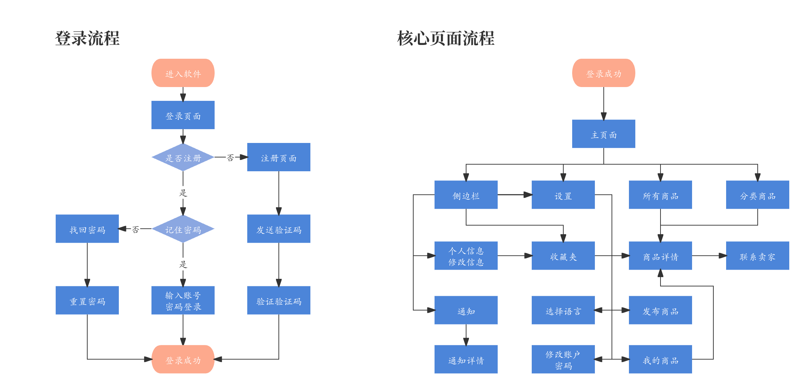

# ZDSwap
Second-hand transaction applet for Sun Yat-sen University: ZDSwap

- **[简体中文](./README-cn.md)**
- **[English](./README.md)**


<div align="center">

## Second-hand transaction applet for Sun Yat-sen University: ZDSwap
[📄[Document](hhttps://github.com/ffengc/ZDSwap/blob/main/README.md)] &emsp; [💻[Platform](https://www.nginx.org.cn/)] &emsp; <br>
[🌅[Code](https://github.com/ffengc/ZDSwap)] &emsp;<br>


</div>

***

- [ZDSwap](#zdswap)
  - [Second-hand transaction applet for Sun Yat-sen University: ZDSwap](#second-hand-transaction-applet-for-sun-yat-sen-university-zdswap)
  - [🌟Collaborators🌟](#collaborators)
  - [📃Project page structure](#project-page-structure)
  - [📸Screenshots](#screenshots)
  - [🐳Deploy nginx service with docker](#deploy-nginx-service-with-docker)

***

## 🌟Collaborators🌟

- Yufc([ffengc](https://github.com/ffengc))
- Songwh([ssugarwh](https://github.com/ssugarwh))
- Linjy([jfightyr](https://github.com/jfightyr))
- Pengyx([KuroisuSan](https://github.com/KuroisuSan))
- Liy([*](#))


## 📃Project page structure

The picture below shows all the pages of this project.



## 📸Screenshots

**home page:**


Other pages are not shown here.

## 🐳Deploy nginx service with docker

Clone the repository:
```bash
https://github.com/ffengc/ZDSwap.git
cd ZDSwap;
```

Deploy using dockerfile:

**1. Create dockerfile**

```dockerfile
FROM nginx:latest
COPY ./wwwroot /usr/share/nginx/html
EXPOSE 8080
CMD ["nginx", "-g", "daemon off;"]
```

**2. Add permissions to files**

Create script`ChMod.sh`

```bash
#!/bin/bash
# write by Yufc
# Check if directory is provided as parameter
if [ "$#" -ne 1 ]; then
    echo "Usage: $0 <directory>"
    exit 1
fi
# Get directory parameters
directory=$1
# Check if directory exists
if [ ! -d "$directory" ]; then
    echo "Error: Directory does not exist."
    exit 1
fi
# Add permissions to all files and folders in the directory and its subdirectories
find "$directory" -type d -exec chmod a+rwx {} \;
find "$directory" -type f -exec chmod a+rwx {} \;
echo "ALL permissions have been added to all files and directories within $directory."
```

run script: `./ChMod.sh ./wwwroot`

**3. Deploy service**


```bash
docker build -t nginx-homepage .
docker run -d -p 8080:80 nginx-homepage
```

**After deployment, just access the server port 8080.**

## Thanks to Suha-Multipurpose Ecommerce Mobile HTML Template for providing the template
